# RAGCore / CVUM — Multi-Level System Design

**Diagram-first design snapshot:** 2026-07-20

**Legend:** blue/solid = **CURRENT**; amber/dashed = **PROPOSED / PHASED**.
**Companion:** `diagram.md` is the synchronized diagram-atlas edition of this complete visual set.

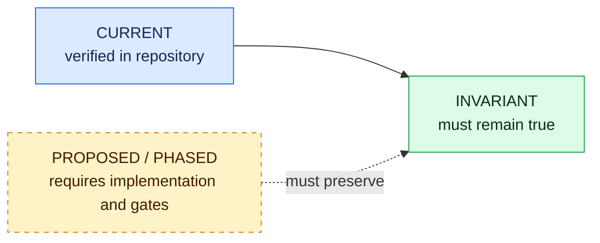

## Design map

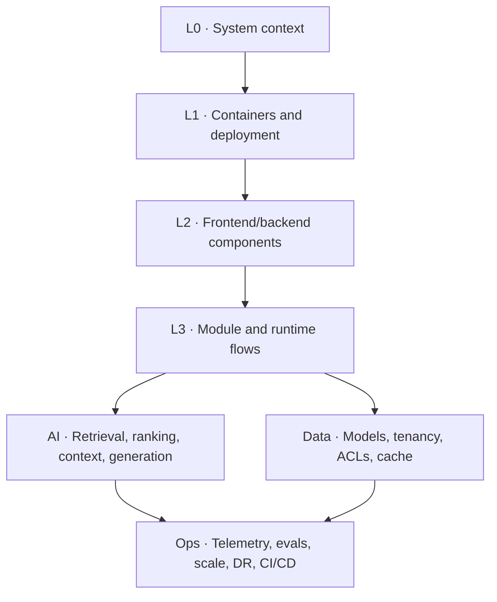

## L0 — System context

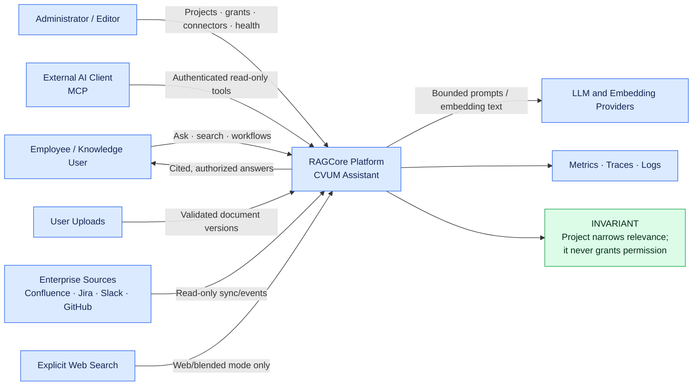

## L1 — Current containers

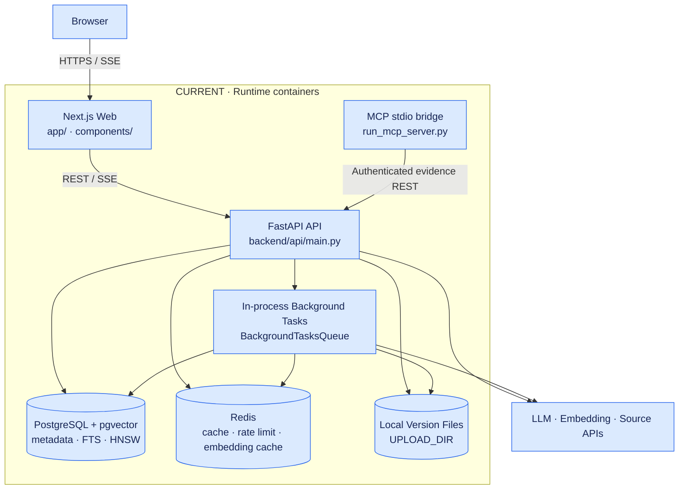

## L1 — Proposed production containers

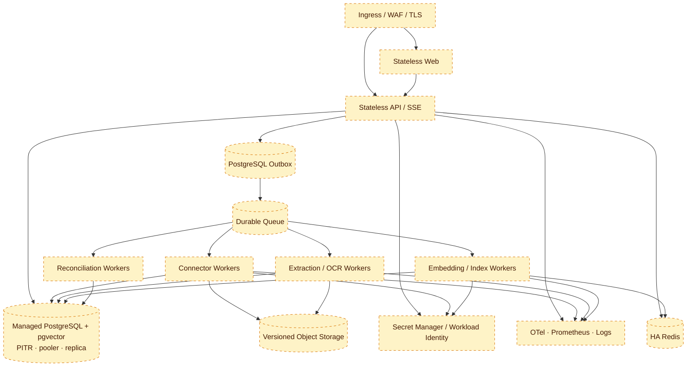

## L2 — Backend components

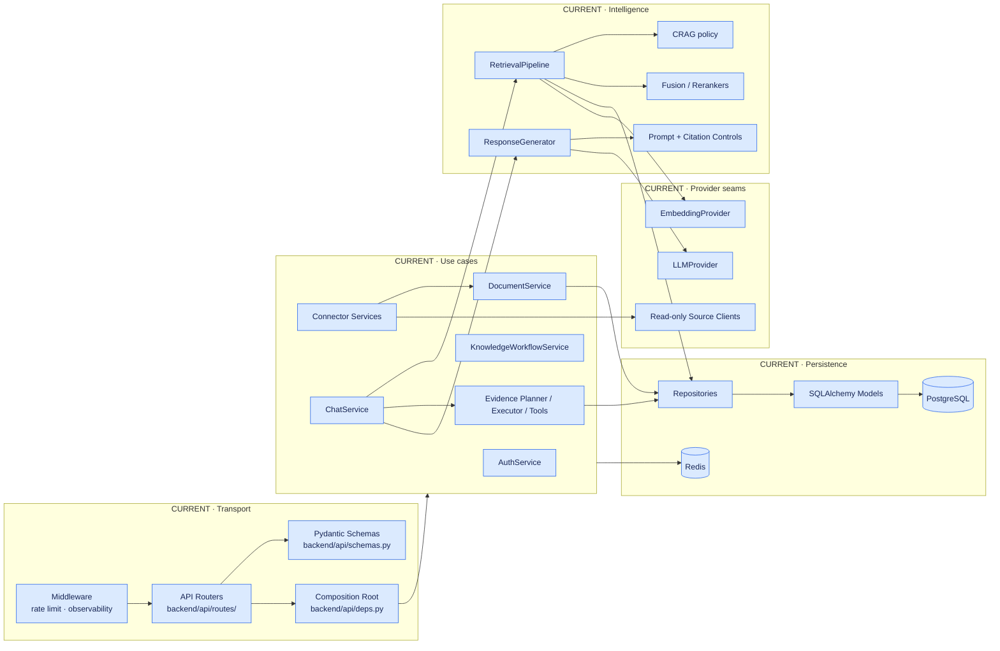

## L2 — Frontend components

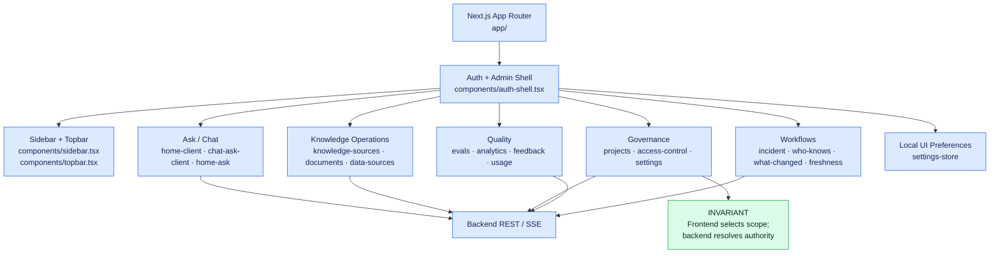

## L3 — Backend dependency flow

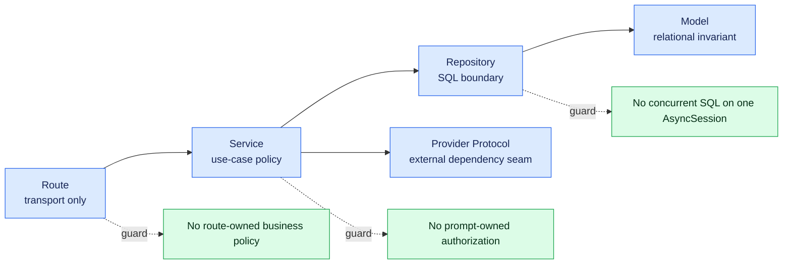

## Upload and ingestion — Current

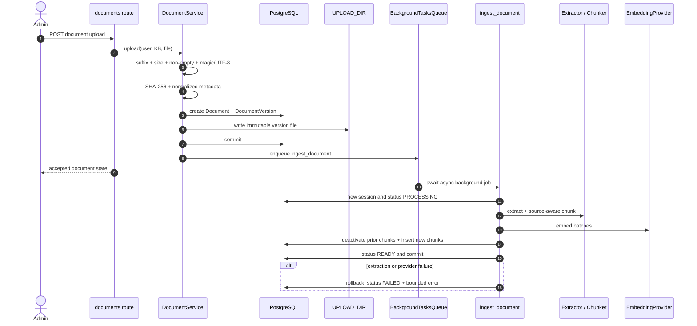

Paths: `backend/services/document_service.py:DocumentService`, `backend/ingestion/queue.py`, `backend/ingestion/pipeline.py:ingest_document`.

## Ingestion — Proposed durable pipeline

```mermaid
flowchart LR
    API["API validation"]
    TX["One DB transaction<br/>version + outbox"]
    Outbox[("Outbox")]
    Queue[("Durable queue")]
    Lease["Worker lease<br/>idempotency key"]
    Artifact[("Object version<br/>URI + checksum")]
    Extract["Sandboxed extraction<br/>limits + malware scan"]
    Context["Contextualization<br/>versioned template/model"]
    Chunk["Structure-aware chunks<br/>manifest"]
    Embed["Batch embeddings<br/>model/text hash cache"]
    Stage["Inactive staging revision"]
    Verify["Count · dimension · lineage checks"]
    Active["Atomic activation"]
    Reconcile["Expired lease / stuck-job reconciler"]

    API --> TX
    TX --> Outbox --> Queue --> Lease
    TX --> Artifact
    Lease --> Artifact --> Extract --> Context --> Chunk --> Embed --> Stage --> Verify --> Active
    Reconcile -.reclaim.-> Lease
    Reconcile -.repair.-> Stage

    INV["INVARIANT<br/>Old active version survives<br/>until new revision is valid"]
    Verify --> INV

    classDef proposed fill:#fef3c7,stroke:#d97706,color:#451a03,stroke-dasharray: 5 5
    classDef invariant fill:#dcfce7,stroke:#16a34a,color:#052e16
    class API,TX,Outbox,Queue,Lease,Artifact,Extract,Context,Chunk,Embed,Stage,Verify,Active,Reconcile proposed
    class INV invariant
```

## Source-aware normalization

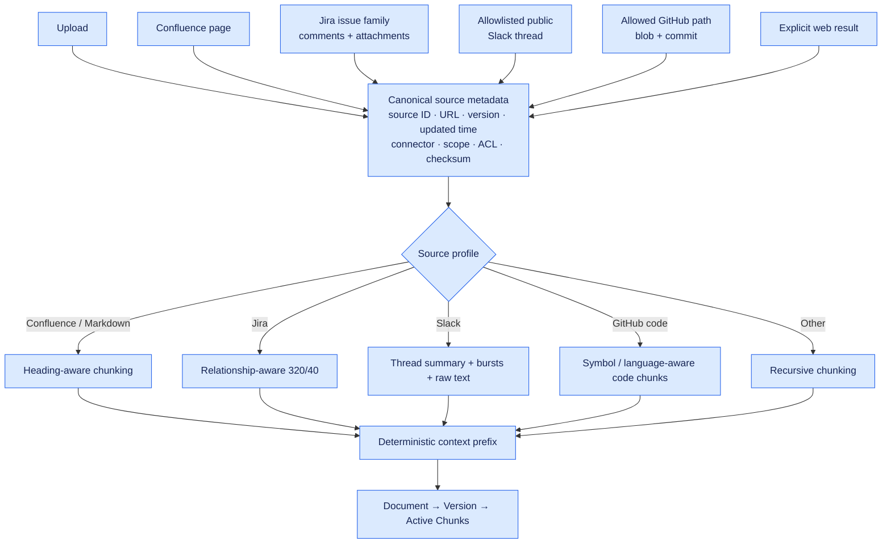

## Connector control contract

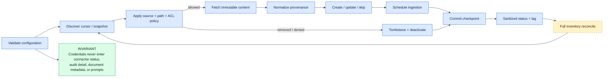

## GitHub repository sync — Current

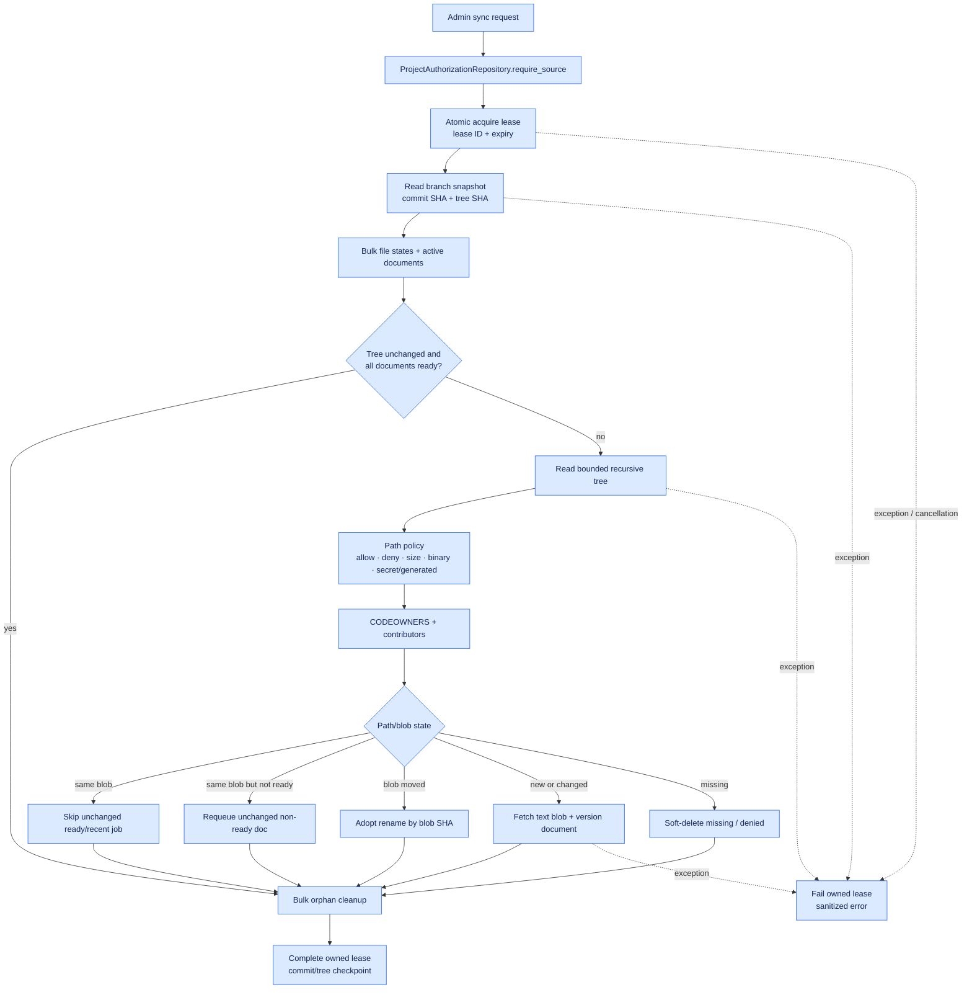

Paths: `backend/services/github_index.py:GitHubIndexService.sync_repository`, `backend/repositories/connectors.py:ConnectorRepository`, `backend/config/alembic/versions/0006_github_sync_lease.py`.

## GitHub sync lease state

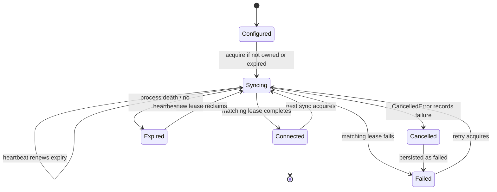

## GitHub lease, heartbeat, cancellation — Current sequence

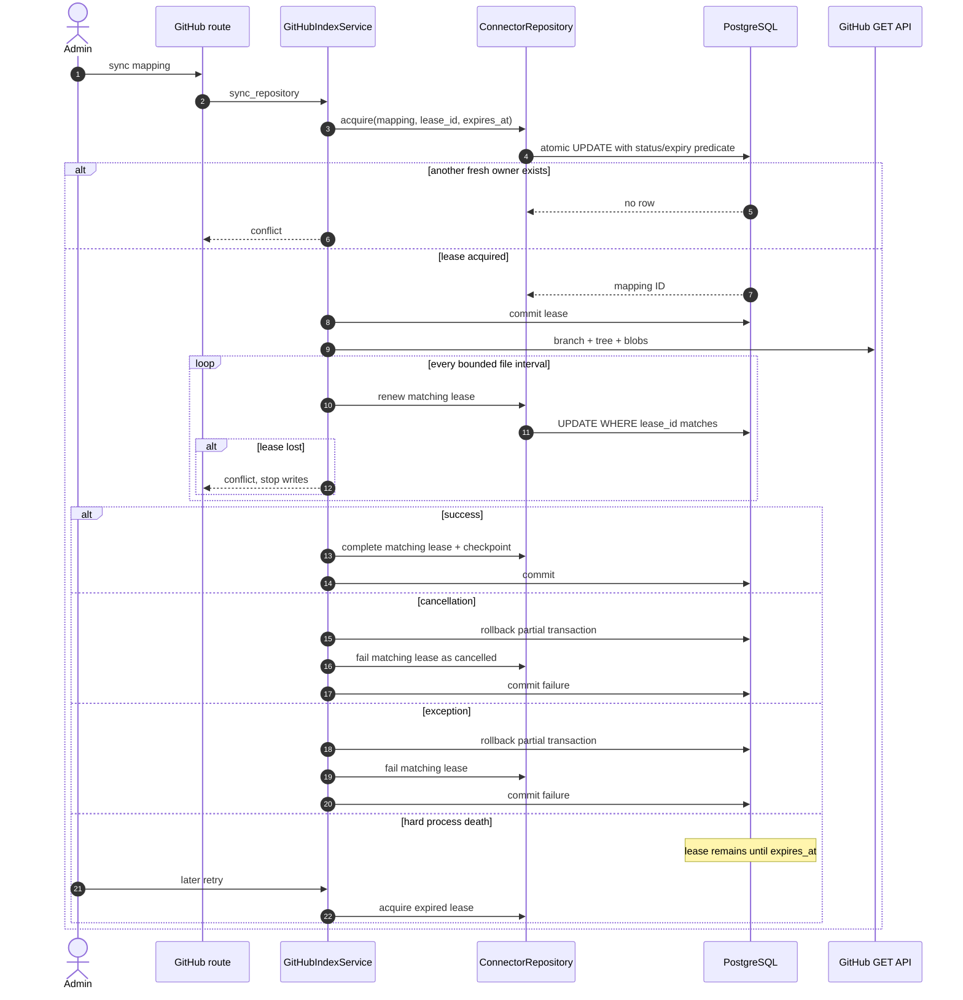

## RAG answer pipeline — Current

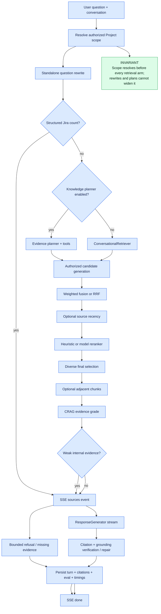

## Hybrid retrieval and ranker — Current detail

```mermaid
flowchart LR
    Q["Effective query"]
    EQ["Embed query"]
    Dense["Dense arm<br/>pgvector cosine HNSW"]
    Sparse["Sparse arm<br/>PostgreSQL FTS + title boost"]
    Exact["Optional exact arm<br/>IDs · paths · flags · issue keys"]
    Rare["Optional rare-token arm<br/>document-frequency signal"]

    Scores["Per-arm native score + rank"]
    Weights["Normalize weights across active arms"]
    Mode{"Fusion mode"}
    Weighted["Weighted normalized fusion"]
    RRF["Weighted Reciprocal Rank Fusion<br/>1 / (k + rank)"]
    Decay["Optional floor-bounded<br/>source recency multiplier"]
    Heuristic["Heuristic reranker"]
    Model{"Ambiguous semantic query<br/>and model reranker enabled?"}
    ModelRank["Bounded model ranking<br/>strict IDs + timeout"]
    Fallback["Heuristic fallback"]
    Diversity["Document + source diversity"]
    Top["Selected top-k + trace"]

    Q --> EQ --> Dense
    Q --> Sparse
    Q --> Exact
    Q --> Rare
    Dense --> Scores
    Sparse --> Scores
    Exact --> Scores
    Rare --> Scores
    Scores --> Weights --> Mode
    Mode -->|weighted| Weighted --> Decay
    Mode -->|rrf| RRF --> Decay
    Decay --> Heuristic --> Model
    Model -->|yes| ModelRank --> Diversity
    Model -->|invalid / timeout / provider error| Fallback --> Diversity
    Model -->|no| Diversity
    Diversity --> Top

    classDef current fill:#dbeafe,stroke:#2563eb,color:#172554
    class Q,EQ,Dense,Sparse,Exact,Rare,Scores,Weights,Mode,Weighted,RRF,Decay,Heuristic,Model,ModelRank,Fallback,Diversity,Top current
```

Paths: `backend/repositories/chunks.py:ChunkSearchRepository`, `backend/retrieval/fusion.py`, `backend/retrieval/rerankers.py:ModelReranker`, `backend/retrieval/pipeline.py:select_final_context`.

## Hybrid ranker — Proposed phased quality path

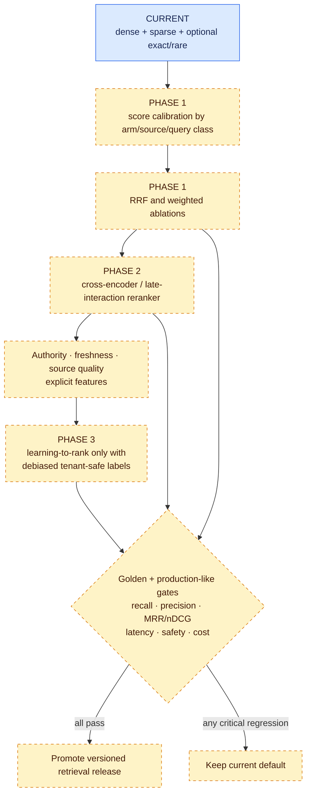

## Contextual retrieval — Current and proposed

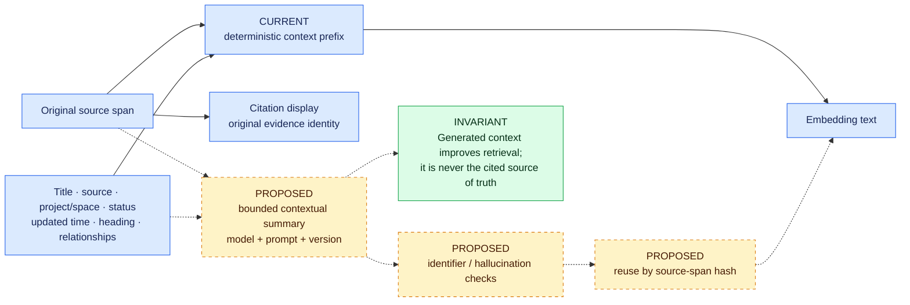

## Context assembly and lost-in-the-middle mitigation

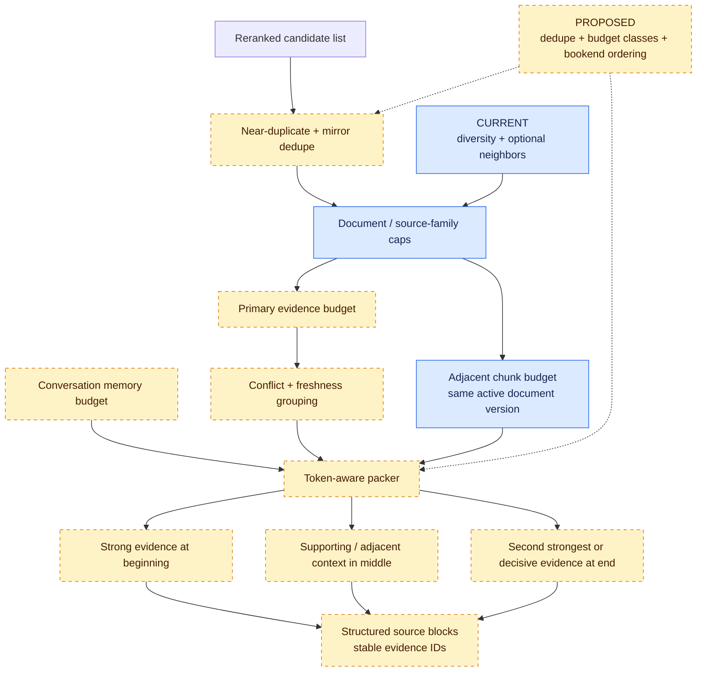

## Corrective retrieval state machine — Current

```mermaid
stateDiagram-v2
    [*] --> Retrieve
    Retrieve --> Evaluate
    Evaluate --> Accept: confidence sufficient
    Evaluate --> WidenK: recoverable low coverage
    Evaluate --> Rewrite: query can be clarified
    Evaluate --> Fallback: weak / exhausted
    WidenK --> Retrieve: bounded larger top-k
    Rewrite --> Retrieve: bounded rewritten query
    Retrieve --> KeepBest: compare with prior attempt
    KeepBest --> Evaluate
    Accept --> FinalContext
    Fallback --> WeakEvidencePolicy
    FinalContext --> [*]
    WeakEvidencePolicy --> [*]

    note right of KeepBest
      Strongest attempt survives;
      weaker retry cannot replace it.
    end note
```

Path: `backend/retrieval/crag.py` and `backend/retrieval/pipeline.py:RetrievalPipeline.run`.

## Chat and SSE — Current sequence

```mermaid
sequenceDiagram
    autonumber
    actor User
    participant UI as Next.js Ask
    participant API as Chat route
    participant Chat as ChatService
    participant Auth as ProjectAuthorizationRepository
    participant RAG as Retrieval / Evidence Tools
    participant LLM as ResponseGenerator
    participant DB as PostgreSQL

    User->>UI: submit question
    UI->>API: ask(conversation, Project, modes)
    API->>Chat: ask as authenticated user
    Chat->>Auth: resolve owned conversation + scope
    Auth-->>Chat: authorized knowledge-base IDs
    Chat->>DB: bounded history
    Chat->>RAG: standalone query + fixed scope
    RAG-->>Chat: ranked chunks + confidence + trace
    Chat-->>UI: SSE sources
    alt weak internal evidence
        Chat-->>UI: bounded refusal delta
    else sufficient evidence
        Chat->>LLM: structured source blocks
        loop streamed tokens
            LLM-->>Chat: delta
            Chat-->>UI: SSE delta
        end
        Chat->>Chat: citations + grounding verification/repair
    end
    Chat->>DB: turn + citations + usage + timings + evaluation
    Chat-->>UI: SSE done
    alt mid-stream provider failure
        Chat-->>UI: terminal SSE error
    end
```

Path: `backend/services/chat_service.py:ChatService.ask`, `backend/chat/prompts.py`, `backend/services/response_generator.py`.

## Claim-level grounding — Proposed high-assurance mode

```mermaid
flowchart LR
    Draft["Model structured draft"]
    Claims["Claims[]<br/>text · evidence IDs · kind · confidence"]
    Schema["Strict schema validation"]
    Allowed["Evidence ID belongs to current<br/>authorized context"]
    Support["Claim/evidence support check"]
    Conflict["Conflict / missing evidence check"]
    Render["Render cited prose"]
    Persist["Persist claim audit + versions"]
    Reject["Repair once or refuse"]

    Draft --> Claims --> Schema --> Allowed --> Support --> Conflict --> Render --> Persist
    Schema -->|invalid| Reject
    Allowed -->|unknown ID| Reject
    Support -->|unsupported| Reject
    Conflict -->|unresolved critical conflict| Reject
    Reject -->|one bounded repair| Draft

    classDef proposed fill:#fef3c7,stroke:#d97706,color:#451a03,stroke-dasharray: 5 5
    class Draft,Claims,Schema,Allowed,Support,Conflict,Render,Persist,Reject proposed
```

## Agentic search and MCP — Current

```mermaid
flowchart TB
    Question["Question + explicit Project"]
    Planner["EvidencePlanner<br/>deterministic or model-assisted"]
    Schema["EvidencePlan schema<br/>≤ 5 tools · ≤ 3 subqueries"]
    Executor["EvidenceExecutor<br/>per-tool + overall deadlines"]

    K["search_knowledge"]
    J["search_jira"]
    C["search_confluence"]
    S["search_slack"]
    Code["search_code"]
    PR["recent_prs"]
    Who["who_knows"]

    Sessions["Independent AsyncSession per tool"]
    Auth["Re-resolve active principal + Project scope"]
    Evidence["Typed Evidence<br/>PermissionContext + citation identity"]
    Synthesis["Existing grounded synthesis"]

    MCP["MCP stdio bridge"]
    REST["Authenticated REST tools"]

    Question --> Planner --> Schema --> Executor
    Executor --> K
    Executor --> J
    Executor --> C
    Executor --> S
    Executor --> Code
    Executor --> PR
    Executor --> Who
    K --> Sessions
    J --> Sessions
    C --> Sessions
    S --> Sessions
    Code --> Sessions
    PR --> Sessions
    Who --> Sessions
    Sessions --> Auth --> Evidence --> Synthesis
    MCP --> REST --> Auth

    INV["INVARIANT<br/>Tools are read-only;<br/>tool output is evidence, not authority"]
    REST --> INV

    classDef current fill:#dbeafe,stroke:#2563eb,color:#172554
    classDef invariant fill:#dcfce7,stroke:#16a34a,color:#052e16
    class Question,Planner,Schema,Executor,K,J,C,S,Code,PR,Who,Sessions,Auth,Evidence,Synthesis,MCP,REST current
    class INV invariant
```

Paths: `backend/services/evidence_contract.py`, `backend/services/evidence_planner.py`, `backend/services/evidence_executor.py`, `backend/services/evidence_tools.py`, `backend/scripts/run_mcp_server.py`.

## Agentic search — Proposed bounded loop

```mermaid
stateDiagram-v2
    [*] --> Classify
    Classify --> Plan
    Plan --> ValidateAuthority
    ValidateAuthority --> ExecuteTools
    ExecuteTools --> AssessCoverage
    AssessCoverage --> Synthesize: evidence adequate
    AssessCoverage --> FollowUpPlan: missing resolvable evidence
    FollowUpPlan --> ExecuteTools: one extra round only
    AssessCoverage --> StopPartial: deadline / budget / repeated query
    Synthesize --> ValidateClaims
    ValidateClaims --> PersistTrace
    ValidateClaims --> StopPartial: unsupported claims
    PersistTrace --> [*]
    StopPartial --> [*]

    note right of FollowUpPlan
      Max three new subqueries;
      no new authority IDs.
    end note
```

## Code execution boundary — Proposed

```mermaid
flowchart LR
    Agent["Agent planner"]
    Broker["Signed tool broker"]
    Sandbox["Ephemeral sandbox<br/>no host FS · no prod creds<br/>CPU/RAM/time limits"]
    Inputs[("Read-only approved inputs")]
    Output["Structured bounded output"]
    Audit["Immutable execution audit"]
    API["RAGCore API"]
    Deny["No retrieved text → shell"]

    Agent -.optional approved tool.-> Broker --> Sandbox
    Inputs --> Sandbox --> Output --> Agent
    Sandbox --> Audit
    API -.does not execute code.-> Deny

    classDef proposed fill:#fef3c7,stroke:#d97706,color:#451a03,stroke-dasharray: 5 5
    classDef invariant fill:#dcfce7,stroke:#16a34a,color:#052e16
    class Agent,Broker,Sandbox,Inputs,Output,Audit proposed
    class API,Deny invariant
```

## Data model — Current

```mermaid
erDiagram
    ORGANIZATION ||--o{ USER : contains
    ORGANIZATION ||--o{ KNOWLEDGE_BASE : owns
    ORGANIZATION ||--o{ PROJECT : owns
    ORGANIZATION ||--o{ CONNECTOR_STATE : configures

    USER ||--o{ REFRESH_TOKEN : rotates
    USER ||--o{ API_KEY : owns
    USER ||--o{ AUDIT_LOG : acts

    PROJECT ||--o{ PROJECT_MEMBER : has
    USER ||--o{ PROJECT_MEMBER : joins
    PROJECT ||--o{ PROJECT_SOURCE : maps
    KNOWLEDGE_BASE ||--o{ PROJECT_SOURCE : appears_in
    USER ||--o{ SOURCE_ACCESS_GRANT : receives
    KNOWLEDGE_BASE ||--o{ SOURCE_ACCESS_GRANT : restricts

    KNOWLEDGE_BASE ||--o{ COLLECTION : groups
    KNOWLEDGE_BASE ||--o{ DOCUMENT : contains
    COLLECTION o|--o{ DOCUMENT : groups
    DOCUMENT ||--o{ DOCUMENT_VERSION : versions
    DOCUMENT_VERSION ||--o{ CHUNK : produces
    DOCUMENT ||--o{ CHUNK : owns

    USER ||--o{ CONVERSATION : owns
    PROJECT ||--o{ CONVERSATION : scopes
    CONVERSATION ||--o{ MESSAGE : contains
    MESSAGE ||--o{ CITATION : cites
    CHUNK ||--o{ CITATION : supports
    MESSAGE ||--o| FEEDBACK : receives

    CONNECTOR_STATE ||--o{ SLACK_CHANNEL_MAPPING : maps
    CONNECTOR_STATE ||--o{ SLACK_EVENT_RECEIPT : deduplicates
    PROJECT ||--o{ GITHUB_REPOSITORY_MAPPING : scopes
    KNOWLEDGE_BASE ||--o{ GITHUB_REPOSITORY_MAPPING : indexes_into
    GITHUB_REPOSITORY_MAPPING ||--o{ GITHUB_FILE_STATE : tracks
    DOCUMENT o|--o| GITHUB_FILE_STATE : materializes
```

Model paths: `backend/models/user.py`, `backend/models/project.py`, `backend/models/knowledge.py`, `backend/models/chat.py`, `backend/models/connector.py`.

## Data model — Proposed enterprise additions

```mermaid
erDiagram
    ORGANIZATION ||--o{ EXTERNAL_PRINCIPAL : owns
    EXTERNAL_PRINCIPAL ||--o{ GROUP_MEMBERSHIP : member
    EXTERNAL_PRINCIPAL ||--o{ DOCUMENT_ACL_ENTRY : grants_or_denies
    DOCUMENT ||--o{ DOCUMENT_ACL_ENTRY : protects

    DOCUMENT_VERSION ||--o{ INGESTION_JOB : schedules
    INGESTION_JOB ||--o{ JOB_ATTEMPT : retries
    CONNECTOR_STATE ||--o{ CONNECTOR_CURSOR : checkpoints
    DOCUMENT ||--o{ KNOWLEDGE_TOMBSTONE : revokes

    EMBEDDING_REVISION ||--o{ CHUNK_EMBEDDING : versions
    CHUNK ||--o{ CHUNK_EMBEDDING : embeds
    RETRIEVAL_RUN ||--o{ RETRIEVAL_CANDIDATE : traces
    MESSAGE ||--o{ ANSWER_CLAIM : decomposes
    ANSWER_CLAIM }o--o{ CHUNK : supported_by

    EXTERNAL_PRINCIPAL {
        uuid organization_id
        string provider
        string external_id
        string principal_type
        bool active
    }
    DOCUMENT_ACL_ENTRY {
        uuid document_id
        uuid principal_id
        string effect
        string permission
        string acl_version
    }
    INGESTION_JOB {
        string idempotency_key
        string state
        uuid lease_owner
        datetime lease_expires_at
        int attempt
    }
    EMBEDDING_REVISION {
        string model
        int dimensions
        string status
        float coverage
    }
```

## Authorization and tenant scope — Current

```mermaid
flowchart TB
    Principal["Authenticated active user<br/>JWT or API key"]
    Org["Organization ownership"]
    Project["Selected/default active Project<br/>membership required"]
    Mapping["ProjectSource mappings"]
    Scope{"KnowledgeBase access_scope"}
    OrgWide["organization-visible"]
    Restricted["restricted"]
    Grant["Explicit SourceAccessGrant"]
    Filter["Optional request source-family filter"]
    Effective["Effective authorized knowledge-base IDs"]

    Principal --> Org --> Project --> Mapping --> Scope
    Scope --> OrgWide --> Effective
    Scope --> Restricted --> Grant --> Effective
    Filter --> Effective

    Equation["organization ∩ membership ∩ Project mapping<br/>∩ restricted grant ∩ request filter"]
    Effective --> Equation
    Equation --> Dense["Dense"]
    Equation --> Sparse["Sparse"]
    Equation --> Exact["Exact / code"]
    Equation --> Relationships["Relationships"]
    Equation --> Workflows["Workflows"]
    Equation --> MCP["REST / MCP"]

    classDef current fill:#dbeafe,stroke:#2563eb,color:#172554
    class Principal,Org,Project,Mapping,Scope,OrgWide,Restricted,Grant,Filter,Effective,Equation,Dense,Sparse,Exact,Relationships,Workflows,MCP current
```

Path: `backend/repositories/projects.py:ProjectAuthorizationRepository.authorized_scope`.

## Item-level ACL — Proposed

```mermaid
sequenceDiagram
    autonumber
    participant Source as Enterprise source
    participant Sync as ACL sync
    participant DB as Policy tables
    participant API as Request
    participant Auth as AuthorizationScope resolver
    participant Search as Search repository
    participant Cache as Cache

    Source->>Sync: content version + ACL version + principals
    Sync->>DB: upsert principals/groups/ACL entries
    Sync->>DB: increment policy version
    Sync->>Cache: invalidate affected scope versions
    API->>Auth: user + Project + request filter
    Auth->>DB: resolve tenant, membership, grants, groups, denies
    Auth-->>Search: immutable AuthorizationScope
    Search->>DB: SQL pre-filter before scoring/content return
    DB-->>Search: authorized candidates only
    Search-->>API: evidence with policy version
    API->>Auth: recheck version before source emission/persistence
```

## Cache and invalidation

```mermaid
flowchart TB
    Request["Search request"]
    Auth["Current authorization scope"]
    Key["Cache key<br/>tenant · user · role · Project<br/>authorized source IDs · query · retrieval flags"]
    Redis[("CURRENT Redis response cache")]
    Search["Authorized retrieval"]
    Result["Search response"]

    Request --> Auth --> Key --> Redis
    Redis -->|miss| Search --> Result --> Redis
    Redis -->|hit| Result

    Policy["PROPOSED policy version"]
    Corpus["PROPOSED corpus checkpoint"]
    Release["PROPOSED retrieval / embedding revision"]
    Invalidate["PROPOSED targeted invalidation"]
    Policy -.-> Key
    Corpus -.-> Key
    Release -.-> Key
    Policy -.-> Invalidate
    Corpus -.-> Invalidate
    Invalidate -.-> Redis

    INV["INVARIANT<br/>No cache key omits tenant and authorization scope"]
    Key --> INV

    classDef current fill:#dbeafe,stroke:#2563eb,color:#172554
    classDef proposed fill:#fef3c7,stroke:#d97706,color:#451a03,stroke-dasharray: 5 5
    classDef invariant fill:#dcfce7,stroke:#16a34a,color:#052e16
    class Request,Auth,Key,Redis,Search,Result current
    class Policy,Corpus,Release,Invalidate proposed
    class INV invariant
```

Paths: `backend/services/cache.py:ResponseCache`, `backend/api/routes/search.py:search`, `backend/embeddings/cache.py`.

## Observability — Current and proposed completion

```mermaid
flowchart LR
    Req["HTTP / SSE request"]
    MW["CURRENT ObservabilityMiddleware<br/>request ID · count · latency · logs"]
    RAG["RAG stages"]
    Jobs["Ingestion / connector jobs"]
    Providers["LLM / embedding / source APIs"]

    Prom[("Prometheus")]
    Logs[("Structured redacted logs")]
    OTel[("Optional OpenTelemetry")]
    Dash["Dashboards + alerts"]

    Req --> MW --> Prom
    MW --> Logs
    MW --> OTel
    RAG -.complete instrumentation.-> Prom
    RAG -.spans.-> OTel
    Jobs -.queue age · stage · freshness.-> Prom
    Jobs -.correlated events.-> Logs
    Providers -.latency · timeout · cost.-> Prom
    Providers -.child spans.-> OTel
    Prom --> Dash
    Logs --> Dash
    OTel --> Dash

    Current["CURRENT<br/>HTTP metrics, request IDs,<br/>redacted logs, health, optional OTel"]
    Proposed["PROPOSED<br/>wire all declared RAG/token/ingestion metrics;<br/>job/provider/freshness traces and SLO alerts"]
    Current --> MW
    Proposed -.-> RAG
    Proposed -.-> Jobs
    Proposed -.-> Providers

    classDef current fill:#dbeafe,stroke:#2563eb,color:#172554
    classDef proposed fill:#fef3c7,stroke:#d97706,color:#451a03,stroke-dasharray: 5 5
    class MW,Prom,Logs,OTel,Current current
    class RAG,Jobs,Providers,Dash,Proposed proposed
```

Paths: `backend/middleware/observability.py`, `backend/core/metrics.py`, `backend/core/logging.py`, `backend/api/routes/health.py`.

## Evaluation and release gate

```mermaid
flowchart TB
    Golden["Golden dataset<br/>source expectations + roles + refusal cases"]
    Candidate["Candidate retrieval release"]
    Baseline["Current default"]
    Run["Offline and integration eval"]

    Retrieval["Retrieval<br/>recall@k · precision · top-k · MRR · nDCG<br/>identifier · relationship · freshness"]
    Context["Context<br/>coverage · diversity · duplicate rate<br/>token efficiency · position sensitivity"]
    Answer["Answer<br/>groundedness · faithfulness · relevance<br/>citation coverage/correctness · completeness"]
    Safety["Safety<br/>ACL leakage · injection · secret leakage<br/>refusal correctness"]
    Ops["Operations<br/>p50/p95/p99 · first token · timeout<br/>provider calls · tokens · cost"]
    Slices["Slices<br/>source · query class · tenant size · role"]

    Gate{"All critical gates pass?"}
    Promote["Promote versioned release"]
    Hold["Keep baseline + record regression"]
    Observe["Canary + production quality telemetry"]
    Rollback["Fast rollback to prior release"]

    Golden --> Run
    Candidate --> Run
    Baseline --> Run
    Run --> Retrieval
    Run --> Context
    Run --> Answer
    Run --> Safety
    Run --> Ops
    Retrieval --> Slices
    Context --> Slices
    Answer --> Slices
    Safety --> Slices
    Ops --> Slices
    Slices --> Gate
    Gate -->|yes| Promote --> Observe
    Gate -->|no| Hold
    Observe -->|SLO/quality regression| Rollback

    classDef current fill:#dbeafe,stroke:#2563eb,color:#172554
    classDef proposed fill:#fef3c7,stroke:#d97706,color:#451a03,stroke-dasharray: 5 5
    class Golden,Baseline,Run,Retrieval,Answer,Safety,Ops current
    class Candidate,Context,Slices,Gate,Promote,Hold,Observe,Rollback proposed
```

Paths: `backend/scripts/run_evals.py`, `backend/api/routes/evals.py`, `evals/golden/rag.jsonl`, `shivam_plan/retrieval_experiment.md`.

## Initial SLO map — Proposed

```mermaid
flowchart LR
    Ask["Ask availability<br/>99.9% monthly"]
    Retrieval["Retrieval p95<br/>< 800 ms"]
    First["First token p95<br/>< 2.5 s"]
    Complete["Fast answer p95<br/>< 10 s"]
    Fresh["Connector freshness p95<br/>< 15 min event sources"]
    Revoke["ACL revocation p99<br/>< 60 s after observation"]
    Durable["Accepted ingestion<br/>99.99% visible terminal/ready"]
    Cite["Factual citation coverage<br/>>= 98%"]
    Leak["Cross-tenant disclosure<br/>zero tolerated"]

    Quality["Enterprise knowledge SLO"]
    Ask --> Quality
    Retrieval --> Quality
    First --> Quality
    Complete --> Quality
    Fresh --> Quality
    Revoke --> Quality
    Durable --> Quality
    Cite --> Quality
    Leak --> Quality

    classDef proposed fill:#fef3c7,stroke:#d97706,color:#451a03,stroke-dasharray: 5 5
    class Ask,Retrieval,First,Complete,Fresh,Revoke,Durable,Cite,Leak,Quality proposed
```

## Security and threat boundaries

```mermaid
flowchart TB
    Trusted["Trusted policy<br/>authenticated principal · server settings<br/>resolved scope"]
    App["Trusted reviewed application code"]

    Input["Untrusted user input"]
    Content["Untrusted source content"]
    Model["Untrusted model output"]
    External["External providers / APIs"]

    Validate["Validate · normalize · bound"]
    Authorize["Authorize before retrieval"]
    Tag["Structured source tags<br/>evidence never instructions"]
    Parse["Strict output schemas<br/>timeouts + fallback"]
    Egress["Least-data egress<br/>host/provider policy"]
    Audit["Sanitized audit + telemetry"]

    Input --> Validate --> Authorize
    Content --> Tag --> Authorize
    Model --> Parse --> Authorize
    External --> Egress --> App
    Trusted --> Authorize
    App --> Authorize --> Audit

    Threats["Threats<br/>cross-tenant IDs · prompt injection · parser exploit<br/>secret indexing · SSRF · cache confusion<br/>cost abuse · stale deletion · MCP deputy"]
    Controls["Controls<br/>composite tenant FKs · pre-filter ACL · sandbox extraction<br/>path/content secret policy · URL allowlist · quotas<br/>tombstones · read-only MCP"]
    Threats -.mitigated by.-> Controls
    Controls --> Authorize

    classDef current fill:#dbeafe,stroke:#2563eb,color:#172554
    classDef proposed fill:#fef3c7,stroke:#d97706,color:#451a03,stroke-dasharray: 5 5
    class Trusted,App,Input,Content,Model,External,Validate,Authorize,Tag,Parse,Egress,Audit current
    class Threats,Controls proposed
```

## Kubernetes deployment — Current manifests

```mermaid
flowchart TB
    Internet["Client"]
    Ingress["Ingress<br/>TLS · 60 MB body · SSE no buffering<br/>300 s read timeout"]
    Service["ClusterIP Service"]
    HPA["HPA<br/>3–12 replicas · CPU 70%"]

    subgraph Pods["API Deployment"]
        Init["Init container<br/>alembic upgrade head"]
        API1["API pod<br/>non-root · requests/limits<br/>readiness + liveness"]
        API2["API pod"]
        API3["API pod"]
    end

    Config["ConfigMap"]
    Secret["Secret template / manager target"]
    PG[("PostgreSQL")]
    Redis[("Redis")]
    Metrics["Prometheus scrape /metrics"]

    Internet --> Ingress --> Service
    Service --> API1
    Service --> API2
    Service --> API3
    HPA --> Pods
    Init --> API1
    Config --> API1
    Secret --> API1
    API1 --> PG
    API1 --> Redis
    API1 --> Metrics

    Gap["PHASED<br/>dedicated migration Job · worker deployments<br/>object storage · network policy · PDB<br/>read-only root FS after local-file removal"]
    Gap -.extends.-> Pods

    classDef current fill:#dbeafe,stroke:#2563eb,color:#172554
    classDef proposed fill:#fef3c7,stroke:#d97706,color:#451a03,stroke-dasharray: 5 5
    class Internet,Ingress,Service,HPA,Init,API1,API2,API3,Config,Secret,PG,Redis,Metrics current
    class Gap proposed
```

Paths: `k8s/deployment.yaml`, `k8s/service.yaml`, `k8s/ingress.yaml`, `k8s/hpa.yaml`, `k8s/configmap.yaml`, `k8s/secret.yaml`.

## Scaling planes — Proposed

```mermaid
flowchart TB
    Load["Measured load"]
    APIQ["HTTP QPS · SSE concurrency<br/>first-token wait"]
    JobQ["Queue age · throughput<br/>provider quota"]
    DBQ["Chunk count · HNSW recall/latency<br/>index memory · write amplification"]

    API["Scale stateless API replicas"]
    IO["Scale connector I/O workers"]
    Extract["Scale extraction/OCR workers"]
    Embed["Scale embedding/index workers"]
    Pool["Connection pooler + query tuning"]
    HNSW["Tune ef_search / iterative scans"]
    Partition["Partition by tenant/domain"]
    Vector["Separate vector service<br/>only after parity gate"]

    Load --> APIQ --> API
    Load --> JobQ
    JobQ --> IO
    JobQ --> Extract
    JobQ --> Embed
    Load --> DBQ --> Pool --> HNSW --> Partition --> Vector

    Gate["Vector-service parity<br/>ACL filtering · deletion · lineage<br/>backup · recall · latency · cost"]
    Vector --> Gate

    classDef proposed fill:#fef3c7,stroke:#d97706,color:#451a03,stroke-dasharray: 5 5
    class Load,APIQ,JobQ,DBQ,API,IO,Extract,Embed,Pool,HNSW,Partition,Vector,Gate proposed
```

## Failure recovery matrix

```mermaid
flowchart LR
    LLM["LLM timeout"]
    Embed["Embedding failure"]
    API["API dies after acceptance"]
    Worker["Worker dies mid-index"]
    Lease["Sync owner dies"]
    Redis["Redis unavailable"]
    PG["PostgreSQL unavailable"]
    ACL["ACL revoked mid-answer"]
    Delete["Source deleted"]
    BadModel["Bad embedding/ranker release"]

    SSE["Terminal SSE error / approved fallback"]
    Retry["Durable retry; old version remains active"]
    Outbox["Outbox recovers accepted job"]
    Inactive["Inactive staging + expired lease reclaim"]
    Expire["Lease expiry + new owner"]
    Degrade["Defined cache/rate-limit degraded policy"]
    Ready["Readiness 503 + managed failover"]
    Recheck["Policy-version recheck before emit/persist"]
    Tombstone["Deactivate + invalidate first; purge later"]
    Rollback["Switch active version / retrieval release"]

    LLM --> SSE
    Embed --> Retry
    API --> Outbox
    Worker --> Inactive
    Lease --> Expire
    Redis --> Degrade
    PG --> Ready
    ACL --> Recheck
    Delete --> Tombstone
    BadModel --> Rollback

    classDef current fill:#dbeafe,stroke:#2563eb,color:#172554
    classDef proposed fill:#fef3c7,stroke:#d97706,color:#451a03,stroke-dasharray: 5 5
    class LLM,Lease,Redis,PG,SSE,Expire,Ready current
    class Embed,API,Worker,ACL,Delete,BadModel,Retry,Outbox,Inactive,Degrade,Recheck,Tombstone,Rollback proposed
```

## Disaster recovery — Proposed

```mermaid
sequenceDiagram
    autonumber
    participant Ops
    participant PG as PostgreSQL PITR
    participant Obj as Versioned object storage
    participant Redis as Redis
    participant App as Isolated RAGCore
    participant Conn as Connector reconciliation
    participant Eval as Auth + retrieval gate

    Ops->>PG: restore to recovery point
    Ops->>Obj: restore/verify object versions and checksums
    Ops->>Redis: start empty
    Ops->>App: deploy pinned application + migrations
    App->>PG: schema and lineage checks
    App->>Obj: artifact sampling
    App->>Eval: auth negative matrix + golden retrieval
    Eval-->>Ops: pass/fail evidence
    Ops->>Conn: resume from durable checkpoints
    Conn->>PG: reconcile without duplicate active documents
    Ops->>Ops: record measured RPO / RTO

    Note over Ops,Eval: Recovery targets must be ratified for each product tier
```

## CI/CD — Current and phased

```mermaid
flowchart LR
    Push["Push / pull request"]
    Lint["Ruff"]
    Type["Mypy<br/>currently advisory in workflow"]
    Test["Pytest + coverage<br/>PostgreSQL/pgvector + Redis"]
    Eval["Golden eval gate"]
    Build["Backend image build"]
    Scan["Trivy high/critical scan"]
    Deploy["Current deploy placeholder<br/>main + production environment"]

    Strict["PHASED<br/>strict changed-code/full typing gate"]
    Front["PHASED<br/>frontend lint + TypeScript + production build"]
    Migration["PHASED<br/>upgrade/downgrade/upgrade disposable DB"]
    Secret["PHASED<br/>secret scan + SBOM + dependency policy"]
    Sign["PHASED<br/>signed image + provenance"]
    Canary["PHASED<br/>migration Job + canary + SLO/eval observation"]
    Rollback["PHASED<br/>automated release rollback"]

    Push --> Lint --> Type --> Test --> Eval --> Build --> Scan --> Deploy
    Push -.-> Front
    Type -.-> Strict
    Test -.-> Migration
    Build -.-> Secret -.-> Sign -.-> Canary -.-> Rollback
    Front -.-> Canary
    Migration -.-> Canary
    Eval -.-> Canary

    classDef current fill:#dbeafe,stroke:#2563eb,color:#172554
    classDef proposed fill:#fef3c7,stroke:#d97706,color:#451a03,stroke-dasharray: 5 5
    class Push,Lint,Type,Test,Eval,Build,Scan,Deploy current
    class Strict,Front,Migration,Secret,Sign,Canary,Rollback proposed
```

Path: `.github/workflows/backend-ci.yml`.

## Phased enterprise roadmap

```mermaid
flowchart LR
    P0["PHASE 0<br/>Baseline + contracts<br/>auth matrix · metrics · release IDs"]
    P1["PHASE 1<br/>Reliability<br/>object store · outbox · durable jobs<br/>leases · tombstones · reconcile"]
    P2["PHASE 2<br/>Enterprise permissions<br/>principals · groups · document ACLs<br/>policy-version caches"]
    P3["PHASE 3<br/>Retrieval quality<br/>contextual retrieval · HNSW tuning<br/>RRF ablation · reranker · context packing"]
    P4["PHASE 4<br/>Bounded agentic search<br/>typed QueryPlan · one follow-up<br/>claim validation"]
    P5["PHASE 5<br/>Scale + governance<br/>quotas · retention · DR · capacity<br/>compliance evidence"]

    G0{"Reproducible baseline<br/>and auth negatives pass"}
    G1{"Kill/recovery tests<br/>no silent loss"}
    G2{"Revocation SLO<br/>all surfaces pass"}
    G3{"Quality gain<br/>no safety/latency regression"}
    G4{"Multi-hop gain within<br/>cost/tool/deadline budgets"}
    G5{"Restore drill + SLOs<br/>runbooks + security review"}

    P0 --> G0 --> P1 --> G1 --> P2 --> G2 --> P3 --> G3 --> P4 --> G4 --> P5 --> G5

    classDef proposed fill:#fef3c7,stroke:#d97706,color:#451a03,stroke-dasharray: 5 5
    class P0,P1,P2,P3,P4,P5,G0,G1,G2,G3,G4,G5 proposed
```

## Enterprise definition of done

```mermaid
flowchart TB
    ACL["Authorization negatives pass<br/>on search · Ask · history · citations<br/>documents · workflows · REST · MCP · caches"]
    Durable["Accepted ingestion is crash-durable<br/>idempotent and reconcilable"]
    Revoke["Deletion and revocation SLOs proven"]
    Lineage["Every citation resolves to source<br/>version · chunk · permission version"]
    Quality["Owned eval set beats baseline<br/>without hidden slice regressions"]
    Safe["Weak/conflicting/partial evidence<br/>has explicit safe behavior"]
    Operate["Metrics · alerts · runbooks · capacity<br/>completed restore drill"]
    Govern["Secrets · provider flow · retention<br/>export · legal hold · purge documented"]
    Browser["Automated + real-browser user flows pass"]
    Docs["Code · migrations · diagrams · API docs<br/>describe the same deployed system"]
    Done["Enterprise-ready RAGCore / CVUM"]

    ACL --> Done
    Durable --> Done
    Revoke --> Done
    Lineage --> Done
    Quality --> Done
    Safe --> Done
    Operate --> Done
    Govern --> Done
    Browser --> Done
    Docs --> Done

    classDef invariant fill:#dcfce7,stroke:#16a34a,color:#052e16
    class ACL,Durable,Revoke,Lineage,Quality,Safe,Operate,Govern,Browser,Docs,Done invariant
```

## Accuracy anchors

| Diagram area | Verified implementation anchors |
|---|---|
| API composition | `backend/api/main.py:create_app`, `backend/api/deps.py` |
| Identity and scope | `backend/core/security.py`, `backend/services/auth_service.py`, `backend/repositories/projects.py:ProjectAuthorizationRepository` |
| Ingestion | `backend/services/document_service.py`, `backend/ingestion/queue.py`, `backend/ingestion/pipeline.py` |
| Hybrid retrieval | `backend/repositories/chunks.py`, `backend/retrieval/pipeline.py`, `backend/retrieval/fusion.py`, `backend/retrieval/rerankers.py`, `backend/retrieval/crag.py` |
| Chat and grounding | `backend/services/chat_service.py`, `backend/services/conversational_retriever.py`, `backend/services/response_generator.py`, `backend/chat/prompts.py` |
| Agentic evidence / MCP | `backend/services/evidence_contract.py`, `backend/services/evidence_planner.py`, `backend/services/evidence_executor.py`, `backend/services/evidence_tools.py`, `backend/scripts/run_mcp_server.py` |
| Connectors | `backend/services/confluence_service.py`, `backend/services/jira_service.py`, `backend/services/slack_service.py`, `backend/services/github_index.py` |
| Storage models | `backend/models/user.py`, `backend/models/project.py`, `backend/models/knowledge.py`, `backend/models/chat.py`, `backend/models/connector.py` |
| Cache and telemetry | `backend/services/cache.py`, `backend/embeddings/cache.py`, `backend/middleware/observability.py`, `backend/core/metrics.py` |
| Deployment and gates | `backend/Dockerfile`, `docker-compose.yml`, `k8s/`, `.github/workflows/backend-ci.yml`, `docs/TESTING.md`, `docs/EVALS.md` |
